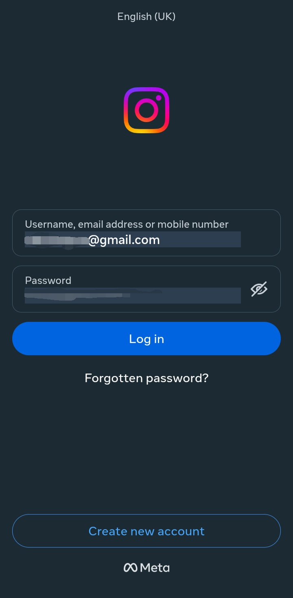
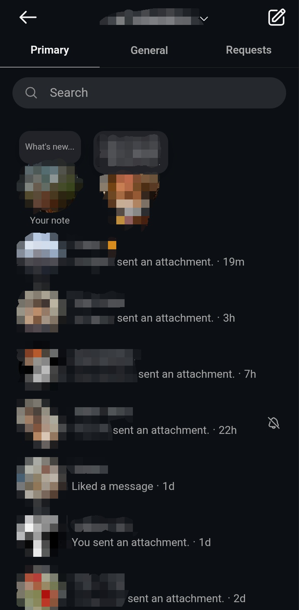
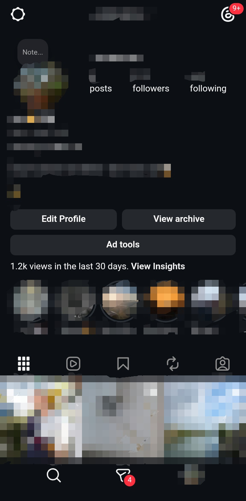
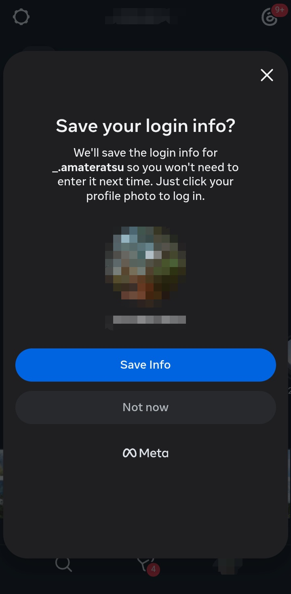
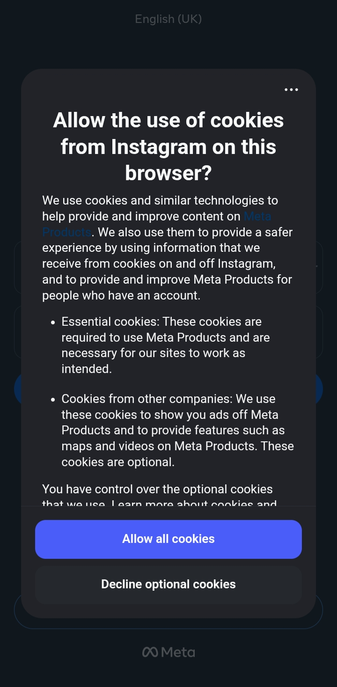
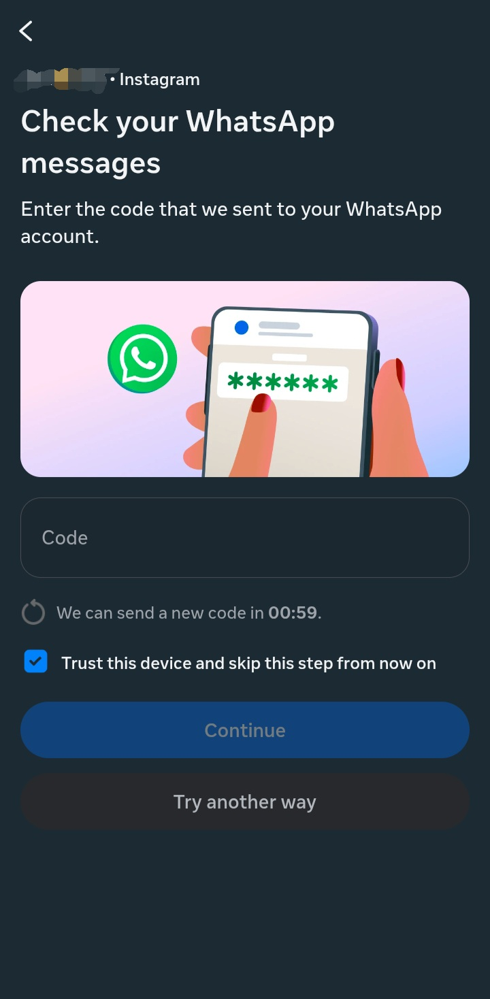

# NoInsta

A lightweight Instagram wrapper focused on direct messages. No feed, no reels, just conversations.

[](https://github.com/frarthur/no-insta/releases)
[](https://flutter.dev)
[](LICENSE)
[]()
[]()

## Download

[](https://github.com/frarthur/no-insta/releases/latest)

Download the latest APK from the [Releases](https://github.com/frarthur/no-insta/releases) page, or build from source:

```
flutter pub get
flutter build apk --release
```

## Screenshots

| Login                           | Chat                          | Profile                             | Data safety                               | Cookies                             | 2FA                         |
| ------------------------------- | ----------------------------- | ----------------------------------- | ----------------------------------------- | ----------------------------------- | --------------------------- |
|  |  |  |  |  |  |

## What the app can do

- Open directly on the DM inbox, skipping the feed.
- Send photos using the device gallery via a native picker (so the app doesn't need media access).
- Record and send voice messages via a native audio recorder.
- (In progress) Browse the search page (suggested content hidden, search bar only).
- Access your profile page.
- Create new posts (the native Instagram composer opens inside the WebView).

Access to:

- Internet connection.
- Microphone (only when you actively use the voice features).

## What the app cannot do

- Browse the Instagram feed (intentionally blocked, redirects to your profile).
- Browse Reels (intentionally blocked, redirects to your profile).
- Display suggested or recommended content on the Explore page.
- Send a photo directly from the camera (take the photo first with your camera app, then send it from the gallery).
- Collect, store, or transmit any personal data. No backend, no database, no analytics. All account credentials and cookies are stored locally by the WebView, just like any browser.

Access to: (original Instagram access)

- 📷 Camera
- 🔷 Nearby devices
- 📁 Photos and videos
- 📍Location
- 📅 Calendar
- 👤 Contacts and accounts
- 🔔 Notifications
- 📞 Phone

## Instagram features intentionally removed

- The main feed (Home tab).
- The Reels tab.
- (In progress) Suggested content on the Explore page.

## Instagram features removed (due to the web version)

- Double tap to like 💔
- x1.5 speed (better for everyone trust me)

## Data and privacy

NoInsta does not collect, log, or share any personal information. It does not contain analytics, trackers, or third-party SDKs beyond what is required to render the WebView and access the device camera, microphone, and photo library.

Instagram sets its own cookies when you log in through the WebView. You can clear them at any time from the app info screen on your device (Clear Storage). This logs you out and removes all locally stored Instagram data.

## Permissions

| Permission | Reason                      |
| ---------- | --------------------------- |
| Internet   | Required to load Instagram. |
| Microphone | Recording voice messages.   |

## How it works

NoInsta is a WebView wrapper around Instagram's mobile website. The app injects CSS and JavaScript to remove the Home and Reels tabs, redirect blocked pages to your profile, and replace the web file picker and microphone with native Flutter alternatives.

## Special information ⚠️

The app use a fake information, so if you received a mail who said your are logged in a Chrome Mobile / Device / Google Pixel 8 etc it's normal, the only real information is your location unless you used a VPN

## Development

Built with Flutter. Uses `webview_flutter` for rendering, `image_picker` for photo selection, and `record` for voice messages.

```
flutter pub get
flutter run
```

## Future features

- Add settings system (choose between Instagram settings or app settings)
- Choose your app icon
- Open Instagram links directly in the app
- Adblock and script support (Tampermonkey) + cookie management

## License

MIT
